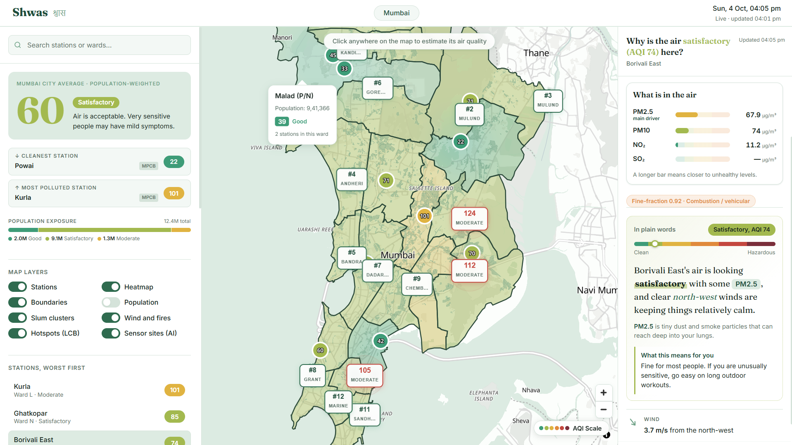

# Shwas (श्वास)

**Demo Video:** [https://youtu.be/HnIcfabFJKQ](https://youtu.be/HnIcfabFJKQ)

**Hyperlocal air quality intelligence for Mumbai: where the air is bad, when it will get worse, and why.**



*Live dashboard: ward map, confidence-gated hotspots, AI-ranked sensor sites and the "Why is the air..." explanation panel.*

Shwas is an end-to-end spatio-temporal air quality intelligence and population exposure platform for dense Indian cities, built and benchmarked on the CPCB station network of Mumbai (24 stations reporting live).

## The Problem

1. **Spatial sparsity:** CPCB continuous ambient air monitoring stations (CAAQMS) are 5 to 15 km apart, so many neighbourhoods and wards have no direct measurement.
2. **Temporal non-stationarity:** coastal sea-breeze shifts and rush-hour spikes break simple models, and heavy batch retraining cannot adapt quickly.
3. **No causal context:** a raw value such as "PM2.5: 142 µg/m³" does not say whether traffic, industry, biomass burning, dust or stagnant wind is responsible.
4. **Actionability gap:** cities lack tools to decide where interventions are needed and where new sensors should go.

Shwas combines **graph attention interpolation** (any location), **rolling SARIMAX forecasting** with weather inputs, **multi-source attribution** (wind, satellite fires, particle ratio, news, LLM summary), **confidence-gated DBSCAN hotspots**, a **ward-coverage sensor placement optimizer**, and an interactive **React and MapLibre GL web application**.

## System Architecture

```
                        [ Ingestion and Data Sanitization ]
   ├── CPCB CAAQMS real-time ingestion (data.gov.in) with exponential backoff
   ├── Historical CAAQMS archives (Kaggle / CPCB, 2015 to present)
   ├── Open-Meteo ERA5 reanalysis and 16-day numerical weather forecasts
   └── Physical anomaly cleaners (PM2.5/PM10 bounds, negative value rejection)
                                    │
                                    ▼
       ┌────────────────────────────┴─────────────────────────────┐
       ▼                                                          ▼
[ Spatial Modeling Engine ]                              [ Temporal Forecasting Engine ]
 ├── Spatial GNN (graph attention network)                ├── Rolling SARIMA (1,0,1)(1,0,0)24
 ├── Distance-weighted k-NN graph (k = 5)                 ├── SARIMAX (+5 hourly ERA5 regressors)
 └── 22.7% lower MAE than IDW                             └── 14.0% lower MAE than plain SARIMA
       │                                                          │
       └────────────────────────────┬─────────────────────────────┘
                                    ▼
                 [ Chained Spatio-Temporal Predictor ]
                   ├── Forecasts every active station 24 h ahead (SARIMAX)
                   ├── Passes the future station values through the Spatial GNN
                   └── 24 h forecast for any (lat, lon)
                                    │
                                    ▼
                 [ Uncertainty Quantification ]
                   ├── Analytical confidence intervals from SARIMAX covariance
                   └── Monte Carlo dropout over the GNN (epistemic variance)
                                    │
       ┌────────────────────────────┴─────────────────────────────┐
       ▼                                                          ▼
[ Attribution and Apportionment ]                       [ Spatial Analytics and Recommendations ]
 ├── Open-Meteo and OpenWeather (wind vectors)           ├── Mumbai bounding box grid scan (2 km)
 ├── NASA FIRMS VIIRS (active fire detection)            ├── DBSCAN hotspots (lower confidence bound)
 ├── PM2.5/PM10 fine-fraction heuristic                  ├── Ward-coverage greedy sensor placement
 ├── GDELT news search                                   └── 24 BMC wards population exposure (Census 2011)
 └── Google Gemini (plain language summary)
                                    │
                                    ▼
                          [ FastAPI REST Backend ]
                                    │
                                    ▼
                 [ React 19 + Vite + MapLibre GL Web App ]
              (polls the API every 5 minutes for live updates)
```

## Methods and Formulas

**1. Baseline: inverse distance weighting (IDW).** With haversine distance $d_i$ from the target location to station $i$:

$$\hat{x}(s)=\frac{\sum_{i=1}^{n} w_i\,x_i}{\sum_{i=1}^{n} w_i},\qquad w_i=\frac{1}{d_i^{\,p}},\quad p=2$$

**2. Spatial GNN.** Nodes are the query location plus all stations. Each node connects to its $k=5$ nearest neighbours with edge weight $w_{ij}=1/(d_{ij}^{2}+\epsilon)$. Each node carries 9 features: normalised latitude and longitude, AQI now, AQI 1 h ago, AQI 3 h ago, and sine and cosine of hour of day and day of week. Two multi-head attention layers (4 heads, hidden size 64) update every node, with attention biased by distance:

$$\alpha_{ij}=\frac{w_{ij}\,\exp\!\left(\dfrac{q_i\cdot k_j}{\sqrt{d}}\right)}{\sum_{m\in\mathcal{N}(i)} w_{im}\,\exp\!\left(\dfrac{q_i\cdot k_m}{\sqrt{d}}\right)},\qquad h_i'=\mathrm{LayerNorm}\!\left(W_o\sum_{j\in\mathcal{N}(i)}\alpha_{ij}\,v_j+W_r\,h_i\right)$$

A small MLP head with a sigmoid on the query node gives the estimate, scaled to the AQI range: $\widehat{\mathrm{AQI}}=500\cdot\sigma\!\left(\mathrm{MLP}(h_q)\right)$.

**3. Uncertainty by Monte Carlo dropout.** Dropout stays active at inference. With $T$ stochastic forward passes $\hat{y}_t$:

$$\mu=\frac{1}{T}\sum_{t=1}^{T}\hat{y}_t,\qquad \sigma=\sqrt{\frac{1}{T}\sum_{t=1}^{T}\left(\hat{y}_t-\mu\right)^{2}}$$

**4. Weather-aware forecast (SARIMAX).** Regression on five ERA5 weather variables $x_t$ (temperature, relative humidity, wind speed, surface pressure, precipitation) with seasonal ARMA errors of order $(1,0,1)(1,0,0)_{24}$:

$$y_t=\beta^{\top}x_t+\eta_t,\qquad \phi(B)\,\Phi(B^{24})\,\eta_t=\theta(B)\,\varepsilon_t$$

**5. Chained forecast at any location $\ell$.** Station forecasts for horizon $h$ are passed through the Spatial GNN:

$$\hat{y}_\ell(t+h)=f_{\mathrm{GNN}}\!\left(\left\{\hat{y}_s(t+h)\right\}_{s\in S},\,\ell\right)$$

**6. CPCB AQI.** Piecewise linear sub-index for each pollutant $p$, and the overall AQI as the maximum:

$$I_p=I_{\mathrm{low}}+\frac{I_{\mathrm{high}}-I_{\mathrm{low}}}{B_{\mathrm{high}}-B_{\mathrm{low}}}\left(C_p-B_{\mathrm{low}}\right),\qquad \mathrm{AQI}=\max_{p}\,I_p$$

where $C_p$ is the concentration and $[B_{\mathrm{low}},B_{\mathrm{high}}]$, $[I_{\mathrm{low}},I_{\mathrm{high}}]$ are the CPCB concentration and index brackets.

**7. Fine-fraction source heuristic.** The ratio of fine to coarse particles separates combustion from dust:

$$\eta=\frac{[\mathrm{PM}_{2.5}]}{[\mathrm{PM}_{10}]}$$

| Ratio | Likely dominant source |
|:-|:-|
| $\eta \ge 0.65$ | Combustion: vehicles, industry, biomass burning |
| $0.40 < \eta < 0.65$ | Mixed urban background |
| $\eta \le 0.40$ | Dust: roads, construction, sea spray |

**8. Confidence-gated hotspots.** A grid cell is a hotspot only if its AQI stays above the threshold (default 100) after subtracting the model uncertainty:

$$\mathrm{LCB}=\mu-z\,\sigma\ \ge\ 100$$

Neighbouring hot cells within 3 km are merged with DBSCAN (haversine metric, `min_samples = 1`), and each cluster reports its worst cell and its cell count.

**9. Sensor placement.** Candidate locations are scored by model uncertainty and the population it affects, where $P$ is the ward population:

$$\mathrm{score}=\sigma\cdot\log_{10}\!\left(1+P\right)$$

Selection runs in two passes: first the best site in every ward that has no station (at least 1 km from existing stations), then the highest scores overall. All recommended sites are kept at least 2 km apart.

**10. Population-weighted city AQI.** A ward uses the mean of its live station readings when it has any, otherwise the GNN estimate. With ward population $P_w$:

$$\overline{\mathrm{AQI}}_{\mathrm{city}}=\frac{\sum_{w} P_w\,\mathrm{AQI}_w}{\sum_{w} P_w}$$

**11. Evaluation metrics.**

$$\mathrm{MAE}=\frac{1}{n}\sum_{i=1}^{n}\left|\hat{y}_i-y_i\right|,\qquad \mathrm{RMSE}=\sqrt{\frac{1}{n}\sum_{i=1}^{n}\left(\hat{y}_i-y_i\right)^{2}},\qquad \Delta=\frac{E_{\mathrm{base}}-E_{\mathrm{model}}}{E_{\mathrm{base}}}\times 100\%$$

## Benchmark Results

All models are evaluated on real historical and live telemetry from CPCB stations across Mumbai. Errors are in AQI points.

### 1. Spatial interpolation: Spatial GNN vs IDW
Leave-one-station-out cross-validation:

| Metric | Baseline IDW | Spatial GNN (ours) | Error reduction |
|:-|:-:|:-:|:-:|
| MAE | 27.47 | **21.24** | **22.7%** |
| RMSE | 36.75 | **27.40** | **25.4%** |

### 2. Temporal forecasting: rolling SARIMA vs seasonal-naive baseline
7-day walk-forward evaluation with rolling 24-hour forecasts (MAE):

| Station | Seasonal naive | Rolling SARIMA | Gain |
|:-|:-:|:-:|:-:|
| Chhatrapati Shivaji Airport (T2) | 4.42 | **3.16** | 1.25 |
| Kurla | 13.52 | **9.16** | 4.35 |
| Powai | 10.35 | **7.57** | 2.79 |
| Sion | 13.92 | **12.02** | 1.89 |
| Worli | 10.38 | **4.73** | 5.64 |
| Borivali East | 18.27 | **12.97** | 5.30 |
| **Fleet average** | **11.81** | **8.27** | **3.54 (6 of 6 stations)** |

Each station model fits in 0.10 to 0.25 s, so there is no multi-hour batch retraining.

### 3. Weather-aware forecasting: SARIMAX vs SARIMA vs baseline
Walk-forward evaluation with five ERA5 weather regressors (MAE):

| Station | Seasonal naive | Plain SARIMA | SARIMAX (+weather) | Weather gain |
|:-|:-:|:-:|:-:|:-:|
| Chhatrapati Shivaji Airport (T2) | 4.42 | 3.16 | **2.92** | 0.24 |
| Kurla | 13.52 | 9.16 | **7.18** | 1.98 |
| Powai | 10.35 | 7.57 | **6.79** | 0.78 |
| Sion | 13.92 | 12.02 | **8.37** | 3.65 |
| Worli | 10.38 | 4.73 | **4.07** | 0.66 |
| Borivali East | 18.27 | **12.97** | 13.35 | -0.38 |
| **Fleet average** | **11.81** | **8.27** | **7.11** | **14.0% lower than SARIMA (5 of 6 stations)** |

### 4. Forecasting at coordinates with no sensor
Station forecasts are chained into the Spatial GNN and evaluated by leave-one-station-out backtesting (MAE):

| Horizon | Baseline (IDW chain) | Shwas (GNN chain) | Error reduction |
|:-:|:-:|:-:|:-:|
| 1 h | 48.5 | **9.0** | **81.4%** |
| 6 h | 50.6 | **9.9** | **80.4%** |
| 12 h | 54.1 | **11.7** | **78.4%** |
| 24 h | 50.6 | **13.5** | **73.3%** |

At 24 hours without an on-site sensor the GNN chain reaches an MAE of 13.5, against 10.3 for a direct SARIMA on the station itself, which is the upper bound because a no-sensor location would never have that history.

### 5. Uncertainty and calibration
* **SARIMA confidence intervals:** 85.1% empirical coverage in walk-forward testing (target 95%), average interval width 35.7 AQI points.
* **GNN Monte Carlo dropout:** the confidence band widens automatically in regions far from active sensors.

## Datasets and Data Sources

| Source | Used for |
|:-|:-|
| [CPCB real-time portal via data.gov.in](https://data.gov.in/) | Hourly PM2.5, PM10, SO2, NO2, CO, O3 and NH3 from Mumbai CAAQMS stations |
| [Air Quality Data in India (Kaggle / CPCB archives)](https://www.kaggle.com/datasets/rohitgr/air-quality-data-in-india) | Historical hourly data for training and walk-forward validation |
| [Open-Meteo](https://open-meteo.com/) | ERA5 reanalysis for training and 16-day forecasts for the SARIMAX weather inputs |
| [OpenWeatherMap](https://openweathermap.org/api) | Live surface weather for wind vectors |
| [NASA FIRMS](https://firms.modaps.eosdis.nasa.gov/) | VIIRS SNPP near real-time active fire detections and Fire Radiative Power |
| [OpenStreetMap Overpass](https://overpass-api.de/) | Coastline, waterways and roads for station geographic features |
| [GDELT](https://www.gdeltproject.org/) | News search for local air quality context |
| [Google Gemini](https://ai.google.dev/) | Plain language summaries of the combined evidence |
| [Bharatlas](https://bharatlas.com/) and Census of India 2011 | BMC ward boundaries (24 wards) and ward population |

## Interactive Web Application

Built with **React 19**, **Vite** and **MapLibre GL**. Live data refreshes every 5 minutes.

* **Ward map:** all 24 BMC wards coloured by AQI, with a smooth interpolated heatmap clipped to ward boundaries. A ward tooltip shows population, AQI and the number of stations in the ward.
* **Station circles:** AQI shown on each station, with zoom-aware labels.
* **Click anywhere:** the Spatial GNN estimates the AQI at any point, with an IDW fallback if the model is unavailable.
* **Station panel:** live PM2.5, PM10, NO2 and SO2 bars, the fine-fraction source badge, and the dominant pollutant.
* **24 hour forecast:** now, peak and best time, with the likely range shaded.
* **Forecast slider:** moves the map from now to 24 hours ahead.
* **Why is the air this way:** wind, active fires, news and a Gemini plain language summary with a health note, using the real category and dominant pollutant.
* **Planning layers:** confidence-gated hotspots, AI-ranked sensor sites (marked when their ward has no station), slum clusters, population and wind overlays.
* **City overview:** population-weighted city average, cleanest and most polluted stations, population exposure by CPCB category, a searchable station list, and an AQI guide.

## REST API Reference

Interactive OpenAPI documentation is served at `/docs`.

| Method | Endpoint | Description |
|:-:|:-|:-|
| `GET` | `/health` | Service health check |
| `GET` | `/api/stations` | Live stations with AQI, PM2.5, PM10, NO2, SO2 and coordinates |
| `GET` | `/api/interpolate?lat={lat}&lon={lon}` | GNN AQI estimate with uncertainty at any Mumbai coordinate |
| `GET` | `/api/forecast/{station_id}?steps=24&uncertainty=true` | 24 hour weather-aware SARIMAX forecast for a station |
| `GET` | `/api/forecast/coordinate?lat={lat}&lon={lon}&steps=24` | Chained forecast at a location with no sensor |
| `GET` | `/api/wards` | Population exposure across all 24 BMC wards |
| `GET` | `/api/attribution/{station_id}` | Wind, nearby fires, news and Gemini summary |
| `GET` | `/api/attribution/{station_id}/apportionment` | 24 hour fine-fraction ratio $\eta$ and source class for a station |
| `GET` | `/api/attribution/city/apportionment` | Citywide fine-fraction summary |
| `GET` | `/api/analytics/hotspots?threshold=100&z=1.96&cluster_radius_km=3` | Confidence-gated hotspot clusters, each with `cluster_size` |
| `GET` | `/api/recommendations/sensor-placement?top_k=12` | Ward-coverage sensor sites, each with a `reason` (`unmonitored_ward` or `coverage_gap`) |

## Repository Structure

```
Shwas/
├── backend/                  FastAPI service
│   ├── alembic/              database migrations
│   ├── app/
│   │   ├── analytics/        grid scan, DBSCAN hotspots, sensor placement, ward exposure
│   │   ├── aqi/              CPCB sub-index breakpoints
│   │   ├── attribution/      wind, NASA FIRMS, news and Gemini attribution
│   │   ├── forecasting/      SARIMA, SARIMAX and the chained coordinate forecast
│   │   ├── ingestion/        CPCB ingestion, anomaly filters, scheduler
│   │   ├── interpolation/    haversine, IDW and live snapshots
│   │   ├── ml/               PyTorch spatial GNN
│   │   ├── models/           SQLAlchemy models
│   │   └── routers/          REST routes
│   ├── evaluate/             forecast and interpolation benchmarks
│   ├── models/               trained GNN weights
│   ├── scripts/              data loading and evaluation runners
│   └── tests/                unit and integration tests
├── frontend/                 React + Vite + MapLibre GL web app
│   └── src/                  components, hooks, utils and ward data
└── docs/                     README images
```

## Verification and Testing

The repository includes 160+ automated tests covering geospatial math, CPCB sub-index calculation, anomaly filters, GNN tensor shapes, SARIMAX fitting, source attribution, hotspot and sensor placement logic, and the FastAPI endpoints.
